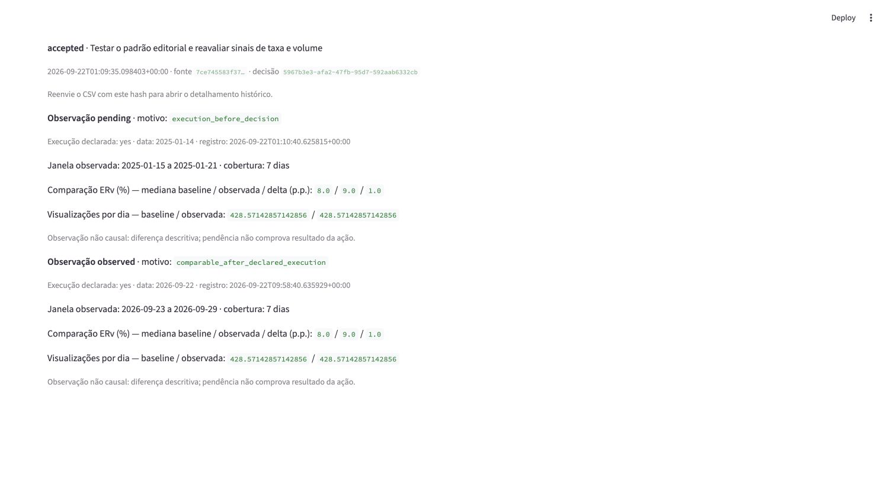

# Submissão — Luis Roquette — Challenge 004

## Sobre mim

- **Nome:** Luis Roquette
- **LinkedIn:** Não informado
- **Challenge escolhido:** 004 — Estratégia Social Media

---

## Executive Summary

Analisei 52.214 posts de cinco plataformas e construí um cockpit local para converter evidências em decisões auditáveis. O dataset histórico é muito homogêneo em ERv agregado: médias simples por plataforma não sustentam uma estratégia. A recomendação principal é testar, nunca ampliar investimento automaticamente, nos contextos priorizados pelo motor; custos reais são pré-requisito para qualquer decisão financeira. O diferencial é fechar o ciclo entre evidência, decisão humana versionada e observação posterior comparável.

---

## Solução

### Abordagem

1. Pesquisei o dataset e comparei frameworks antes da SPEC.
2. Conduzi 24 ondas socráticas adaptativas para definir problema, operador, métricas e limites.
3. Especifiquei e construí em SDD, sempre em Planejamento → Revisão → Execução → Teste.
4. Separei motor Pandas puro, persistência SQLite e composição Streamlit.
5. Reproduzi análise, exports, persistência e interface com testes, CSV real e navegador.

### Resultados / Findings

- Escopo: 52.214 posts, 5.000 creators, 527.376.193 views e 104.966.242 interações, de 29/05/2023 a 28/05/2025.
- Mediana ERv geral: 19,8992%; ERv ponderado: 19,9035%. As diferenças agregadas entre plataformas, formatos e categorias são pequenas e não justificam redistribuição isolada.
- Patrocínio: 137 estratos elegíveis, 162 insuficientes e cobertura de 93,7909% dos posts, controlando plataforma, formato, categoria, faixa de creator e período.
- Maior associação patrocinada observada: YouTube / mixed / beauty / 500.000+, +0,212889 p.p. de ERv; menor: TikTok / video / lifestyle / 10.000–49.999, −0,262464 p.p. Nenhuma é efeito causal ou ROI.
- O cockpit mantém posts zero/taxas indefinidas, explica benchmark/amostra/força até as linhas de origem, registra aceitar/rejeitar/editar, vincula revisões e preserva outcomes após reinício; cronologia inválida permanece pendente.

### Recomendações

1. **Segunda-feira:** revisar a fila determinística e testar o primeiro contexto sob controle; não interpretar a prioridade histórica minúscula como oportunidade atual.
2. **Patrocínio:** exigir custos reais, contraparte orgânica e ao menos 30 taxas/5 creators por braço; força abaixo de 0,40 pede coleta/teste, não escala.
3. **Conteúdo:** usar a cadência observada de 1 post/creator/semana como hipótese testável nos três contextos priorizados, com revisão após sete dias.
4. **Creators e audiência:** preservar faixa e rótulos do contexto; não criar persona ou threshold universal de seguidores.
5. **Parar/revisar:** não renovar ou interromper por média global/sinal isolado; agir apenas com sinais concordantes, evidência forte e decisão humana registrada.

### Limitações

- Não existem investimento, custo de produção, receita ou conversão; custo implícito e ROI financeiro não podem ser calculados.
- Views não são alcance único; rótulos de audiência não provam engajamento individual.
- O dataset termina em 2025; não representa desempenho atual em 2026.
- Atualização é manual e local. Não há integrações, cloud, publicação ou investimento automático.
- HR-01 permanece pendente: um Gestor de Social Media real ainda deve concluir o roteiro cronometrado em até cinco minutos.

---

## Process Log — Como usei IA

### Ferramentas usadas

| Ferramenta | Para que usou |
|---|---|
| Codex | Pesquisa, ondas socráticas, SDD, implementação, regressões, documentação e auditoria final |
| Claude Code | Skill SDD e estruturação inicial dos artefatos de especificação |
| Chrome automatizado | Validação do upload real, decisões, reinício, erros, downloads e prova visual |
| Python/Pandas/unittest | Motor determinístico, reconciliação e 52 testes locais |

### Workflow

1. Absorção iterativa do briefing até duas passadas sem novos achados.
2. Pesquisa obrigatória, 24 ondas socráticas e decisão humana sobre o MVP.
3. SPEC e plano revisados em loops até duas passadas sem melhoria substancial.
4. Construção em fases SDD, com cada falha devolvida à camada responsável.
5. Validação limpa, CSV real, navegador, A4, matriz CK/HR e handoff local.

### Onde a IA errou e como corrigi

A IA inicialmente confundiu seleções editoriais com a fila do motor, normalizou recomendações sobre candidatos elegíveis em vez de todos os grupos e deixou controles CSV escaparem da neutralização. Revisões e regressões devolveram cada erro à origem. Na revisão P2, também foram corrigidos benchmark omitido, cronologia futura inválida, revisão apenas na API e outcomes ocultos após reinício. No gate final, a reprodução ocorreu em ambiente virtual limpo, sem mascarar dependências.

### O que eu adicionei que a IA sozinha não faria

Defini a documentação como parte central da entrega: registrar como o arquiteto desenha, como o engenheiro constrói e como o feedback muda a obra. Exigi pesquisa antes do framework, SDD, cinco ou mais ondas adaptativas de perguntas e loops com gates objetivos. Também preservei o Gestor de Social Media como operador principal e escolhi um MVP manual, explicável e auditável em vez de automações prematuras.

---

## Evidências

- [x] [Screenshot final do cockpit](./process-log/evidence/004/cockpit-proof.png)
- [x] [Diário completo, incluindo as 24 ondas e correções](./process-log/004-social.md)
- [x] [Pesquisa anterior ao framework](./research/004-social.md)
- [x] [Análise executiva](./solution/004-social/analysis.md)
- [x] [Evidências exportadas](./solution/004-social/evidence.csv)
- [x] [Setup e demonstração](./solution/004-social/README.md)
- [x] Git history local; publicação por PR ainda não autorizada
- [ ] Screen recording e HR-01 humano cronometrado

---

_Submissão preparada localmente em: 21/09/2026_
