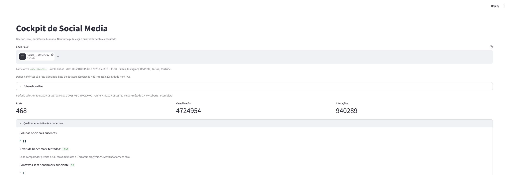
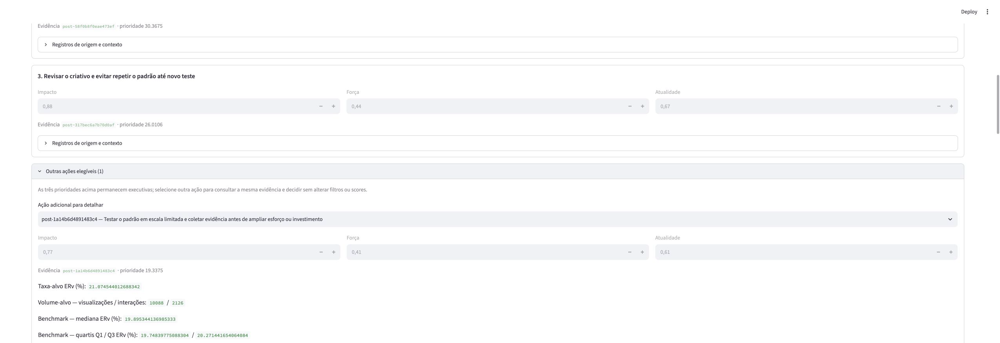
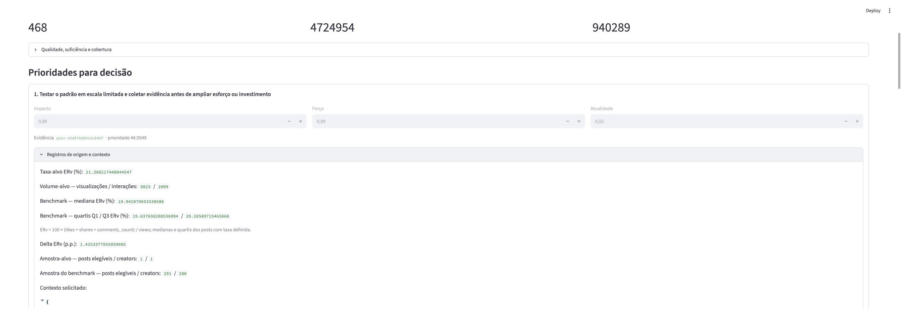
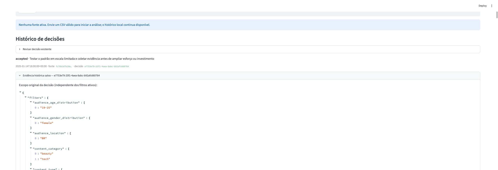
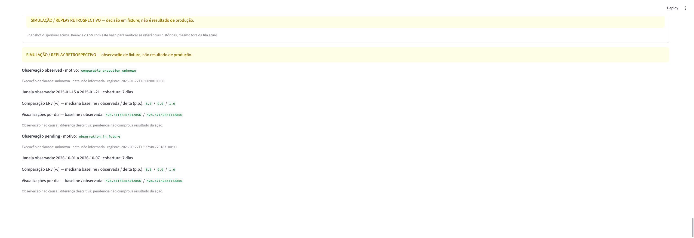

# Submissão — Luis Roquette — Challenge 004

## Sobre mim

- **Nome:** Luis Roquette
- **LinkedIn:** [linkedin.com/in/luisroquette](https://www.linkedin.com/in/luisroquette)
- **Challenge escolhido:** 004 — Estratégia Social Media

---

## As quatro respostas obrigatórias em 60 segundos

| Pergunta do Head de Marketing | Resposta do método 2.5 |
|---|---|
| **O que gera engajamento de verdade?** | **Não existe vencedor sustentado.** Nenhum dos 20 contextos avaliados passou simultaneamente amostra, materialidade, estabilidade e força. Manter o mix e testar antes de redistribuir esforço. |
| **Vale patrocinar influenciadores?** | **Não escalar agora.** A cobertura comparável é 1,56%, a melhor força é 0,280 e não existem custos ou conversões para provar ROI. |
| **Qual deve ser a estratégia?** | **Executar um programa controlado de 30 dias.** Validar YouTube, vídeo, estilo de vida e creators de 100.000–499.999 seguidores, preservando o mix fora do teste. |
| **Qual perfil de audiência mais engaja?** | **Não é possível eleger um perfil.** Idade, gênero e localização tiveram 0% de cobertura em comparações controladas; inferir uma persona seria opinião, não evidência. |

Analisei **52.214 posts de cinco plataformas** e construí um cockpit local que converte evidência em decisão auditável. As respostas acima são operacionais, mas não ultrapassam os dados: associação não vira causalidade e engajamento não vira ROI.

## Decisões para começar na segunda-feira

- **Concentrar esforço:** validar YouTube / vídeo / estilo de vida / creators de 100.000–499.999 durante 30 dias, sem alterar o restante do mix.
- **Cadência:** testar a mediana observada de um post por creator por semana completa; tratar como hipótese, não frequência ótima.
- **Patrocínio:** não escalar; exigir custo, conversão, três meses estáveis, força ≥0,40 e cenário abaixo do ponto de equilíbrio. Nenhum threshold de seguidores justifica investimento sozinho.
- **Parar agora:** interromper a escala irrestrita de patrocínio e decisões baseadas em médias globais; não cancelar contratos por um único sinal fraco.
- **Quick win:** preparar o brief do contexto prioritário, registrar o baseline e iniciar a primeira janela de sete dias.

## Percurso executivo — menos de cinco minutos

1. Leia as quatro respostas e decisões acima — **1 minuto**.
2. Percorra o [tour do produto no Arcade](https://app.arcade.software/share/VHx5b51f94IAFSr6pmds) — **3 minutos**.

## Construção — artefatos obrigatórios da entrega

- [Vídeo de arquitetura apresentado pelo autor](./docs/004-social/assets/architecture-walkthrough-captioned.mp4) — **6min06s**, fora do percurso executivo de cinco minutos

### Síntese visual do NotebookLM

- [Vídeo-síntese](./docs/004-social/assets/notebooklm-video.mp4)
- [Mapa mental](./docs/004-social/assets/notebooklm-mind-map.png)
- [Infográfico executivo](./docs/004-social/assets/notebooklm-infographic.png)

### Auditoria e anexos

- [Estudo de caso em Markdown](./docs/004-social/CONSTRUCTION-STORY.md) e [DOCX](./docs/004-social/CONSTRUCTION-STORY.docx)
- [Evolução prompt → produto](./docs/004-social/assets/methodology-evolution.png)
- [Análise executiva](./solution/004-social/analysis.md) e [evidências reproduzíveis](./solution/004-social/evidence.csv)
- [Diário integral](./process-log/004-social.md) e [manifesto da entrega](./docs/004-social/DELIVERY-MANIFEST.md)

---

## Solução

### Abordagem

1. Pesquisei o dataset e comparei frameworks antes da SPEC.
2. Conduzi 24 ondas socráticas adaptativas para definir problema, operador, métricas e limites.
3. Especifiquei e construí em SDD, sempre em Planejamento → Revisão → Execução → Teste.
4. Separei motor Pandas puro, persistência SQLite e composição Streamlit.
5. Reproduzi análise, exports, persistência e interface com testes, CSV real e navegador.

### Resultados / Findings

- Escopo: 52.214 posts, 5.000 creators, 527.376.193 views e 104.966.242 interações, de 29/05/2023 a 28/05/2025.
- Mediana ERv geral: 19,8992%; ERv ponderado: 19,9035%. Vinte contextos foram avaliados; nenhum passou simultaneamente amostra, materialidade, estabilidade e força.
- Patrocínio: 12 estratos mensais elegíveis, 5.216 sem contraparte/amostra suficiente e cobertura de 1,55897% dos posts, controlando plataforma, formato, categoria, faixa de creator e mês-calendário.
- Melhor contexto patrocinado comparável na síntese executiva: YouTube / vídeo / beauty / 500.000+, +0,097 p.p.; pior: Bilibili / vídeo / estilo de vida / 500.000+, −0,136 p.p. Nenhum é efeito causal ou ROI.
- O cockpit mantém posts zero/taxas indefinidas, explica benchmark/amostra/força até as linhas de origem e preserva a fila completa. `analysis_state` impede que recorte vazio pareça desempenho zero: fonte, filtros e histórico permanecem, enquanto KPIs/prioridades/downloads somem. Delta ausente não vira zero. A cronologia usa o calendário civil da fonte; revisões/outcomes sobrevivem ao reinício.

As capturas abaixo registram o ciclo validado `2.4.0` que antecedeu o refinamento executivo `2.5.0`; a análise, o CSV e os testes citados acima são a prova final do método atual.

### Recomendações

1. **Segunda-feira:** iniciar o baseline do programa de 30 dias para YouTube / vídeo / estilo de vida / 100.000–499.999; preservar o mix fora do teste.
2. **Patrocínio:** exigir custos reais, contraparte orgânica e ao menos 30 taxas/5 creators por braço; força abaixo de 0,40 pede coleta/teste, não escala.
3. **Conteúdo:** medir baseline, testar o candidato elegível, replicar somente se o sinal persistir e decidir na quarta semana; nenhuma cadência é inventada quando a evidência não a sustenta.
4. **Creators e audiência:** preservar faixa e rótulos do contexto; não criar persona ou threshold universal de seguidores.
5. **Parar/revisar:** não renovar ou interromper por média global/sinal isolado; agir apenas com sinais concordantes, evidência forte e decisão humana registrada.

### Limitações

- Não existem investimento, custo de produção, receita ou conversão; custo implícito e ROI financeiro não podem ser calculados.
- Views não são alcance único; rótulos de audiência não provam engajamento individual.
- O dataset termina em 2025; não representa desempenho atual em 2026.
- Atualização é manual e local. Não há integrações, cloud, publicação ou investimento automático.
- HR-01 permanece pendente: um Gestor de Social Media real ainda deve concluir o roteiro cronometrado em até cinco minutos.

---

## Process Log — Como usei IA

### Ferramentas usadas

| Ferramenta | Para que usou |
|---|---|
| Codex | Pesquisa, ondas socráticas, SDD, implementação, regressões, documentação e auditoria final |
| Claude Code | Skill SDD e estruturação inicial dos artefatos de especificação |
| Chrome automatizado | Validação do upload real, decisões, reinício, erros, downloads e prova visual |
| Python/Pandas/unittest | Motor determinístico, reconciliação e catálogo final de 146 testes |

### Workflow

1. Absorção iterativa do briefing até duas passadas sem novos achados.
2. Pesquisa obrigatória, 24 ondas socráticas e decisão humana sobre o MVP.
3. SPEC e plano revisados em loops até duas passadas sem melhoria substancial.
4. Construção em fases SDD, com cada falha devolvida à camada responsável.
5. Validação limpa, CSV real, navegador, A4, matriz CK/HR e handoff local.

### Onde a IA errou e como corrigi

A IA inicialmente confundiu seleções editoriais com a fila do motor, normalizou recomendações sobre candidatos elegíveis em vez de todos os grupos e deixou controles CSV escaparem da neutralização. Revisões e regressões devolveram cada erro à origem. Na revisão P2, também foram corrigidos benchmark omitido, cronologia futura inválida, revisão apenas na API e outcomes ocultos após reinício. No gate final, a reprodução ocorreu em ambiente virtual limpo, sem mascarar dependências.

### O que eu adicionei que a IA sozinha não faria

Defini a documentação como parte central da entrega: registrar como o arquiteto desenha, como o engenheiro constrói e como o feedback muda a obra. Exigi pesquisa antes do framework, SDD, cinco ou mais ondas adaptativas de perguntas e loops com gates objetivos. Também preservei o Gestor de Social Media como operador principal e escolhi um MVP manual, explicável e auditável em vez de automações prematuras.

---

## Auditoria completa

- [x] **Produto:** [tour público no Arcade](https://app.arcade.software/share/VHx5b51f94IAFSr6pmds), [setup e roteiro](./solution/004-social/README.md) e [vídeo obrigatório de arquitetura](./docs/004-social/assets/architecture-walkthrough-captioned.mp4), preservado fora da rota executiva de cinco minutos
- [x] **NotebookLM:** [vídeo](./docs/004-social/assets/notebooklm-video.mp4), [mapa mental](./docs/004-social/assets/notebooklm-mind-map.png) e [infográfico](./docs/004-social/assets/notebooklm-infographic.png), entregues como arquivos sem acesso à conta proprietária
- [x] **Construção:** [estudo de caso](./docs/004-social/CONSTRUCTION-STORY.md), [DOCX](./docs/004-social/CONSTRUCTION-STORY.docx), [linha do tempo](./docs/004-social/assets/methodology-evolution.png), [pesquisa](./research/004-social.md) e [diário](./process-log/004-social.md)
- [x] **Resultados:** [análise](./solution/004-social/analysis.md), [evidence.csv](./solution/004-social/evidence.csv), [provas visuais](./process-log/evidence/004/) e [manifesto com hashes](./docs/004-social/DELIVERY-MANIFEST.md)
- [ ] **Validação humana:** HR-01 cronometrado permanece pendente

---

_Submissão preparada localmente em: 22/09/2026_
