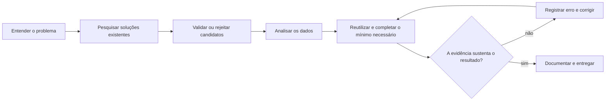
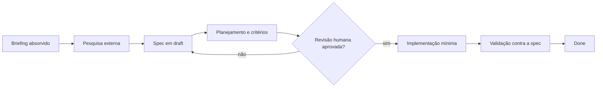

# Diário de processo: pré-início

- **Data:** 21 de setembro de 2026
- **Estado:** preparação concluída; análise dos dados ainda não iniciada
- **Desafio deste terminal:** 001, Diagnóstico de Churn

## Por que este registro existe

Antes de baixar dados ou construir uma solução, organizamos como o trabalho será executado e comprovado. Esta etapa evita dois problemas comuns: começar pela ferramenta sem entender a decisão de negócio e reconstruir o processo artificialmente no final.

O registro abaixo resume apenas decisões que realmente aconteceram. Conversas extensas, raciocínio interno e detalhes sem efeito sobre a entrega ficaram de fora.

## O que fizemos até aqui

1. Lemos o README geral, o guia de submissão, o template e as regras do Pull Request.
2. Lemos os quatro desafios completos e identificamos entregáveis, critérios de qualidade e riscos analíticos.
3. Luis decidiu resolver os quatro desafios em paralelo, usando um terminal por desafio.
4. Criamos um briefing comum para impedir divergência de método e conflitos entre os terminais.
5. Adicionamos duas regras permanentes: pesquisa de soluções existentes antes de construir e Ponytail em modo `full`.

Depois disso, este terminal assumiu o Challenge 001. O repositório foi clonado a partir do fork de Luis, com o upstream do G4 preservado, e a branch `submission/luis-roquette` foi criada no commit-base `4aed364`.

## O briefing pré-início

O briefing funciona como contrato operacional entre os quatro terminais. Cada um tem um desafio, um diretório e um process log próprios. Somente o terminal orquestrador consolida o README executivo e integra as branches na submissão final.

### Divisão de responsabilidade

| Terminal | Desafio | Resultado esperado |
|---|---|---|
| 1, orquestrador | 001, Churn | causa raiz, contas em risco e ações por impacto financeiro |
| 2 | 002, Suporte | diagnóstico operacional, fronteira humano/IA e protótipo |
| 3 | 003, Lead Scorer | ferramenta executável com ranking explicável |
| 4 | 004, Social Media | estratégia controlada por dados e ferramenta recorrente |

Os terminais trabalham em branches e worktrees separados. A entrega será reunida em um único Pull Request, conforme a regra de um PR por candidato.

### Fluxo comum

### Pesquisa antes de construção

Antes de criar análise, modelo, automação ou interface, cada terminal deve:

1. descrever o problema exato em uma frase pesquisável;
2. buscar prioritariamente soluções prontas no GitHub e relatos de uso no Reddit;
3. comparar licença, testes, releases, issues e aderência ao problema;
4. reproduzir a menor prova útil do candidato mais promissor;
5. reutilizar a solução compatível ou documentar por que ela foi rejeitada.

Stars e upvotes ajudam na triagem, mas não provam funcionamento. Código reutilizado precisa de licença compatível e atribuição clara.

### Regra Ponytail

O Ponytail `4.10.0` já estava instalado e habilitado no Codex. Confirmamos a versão local contra o repositório oficial antes de adotá-lo.

No projeto, a regra significa procurar nesta ordem: necessidade real, solução já existente, biblioteca padrão, recurso nativo, dependência instalada e, somente depois, código novo. Lógica não trivial precisa do menor teste capaz de detectar regressão. Segurança, validação, acessibilidade e integridade dos dados não podem ser simplificadas.

## Como a IA foi usada nesta etapa

| Ferramenta | Uso | Verificação humana |
|---|---|---|
| Codex | leitura comparativa dos documentos e elaboração do briefing | Luis definiu quatro desafios em paralelo e escolheu o 001 para este terminal |
| Busca web e GitHub CLI | consulta aos arquivos do repositório e verificação do Ponytail | fontes oficiais, versão instalada e remotes foram conferidos |
| Git | preparação do repositório e da branch de submissão | estado limpo e commit-base foram verificados antes da primeira alteração |

## Erros e correções já registrados

Na primeira consulta à árvore do GitHub, o zsh interpretou `?recursive=1` como um glob. A rota foi colocada entre aspas e a consulta passou. Nenhum arquivo foi alterado por esse erro.

Também evitamos reinstalar o Ponytail. A pesquisa mostrou que o plugin oficial já estava instalado, habilitado e na mesma versão publicada. Duplicar a instalação criaria duas fontes de configuração sem benefício.

Ao preparar este registro, o `git status` não exibiu o arquivo porque a linha 16 do `.gitignore` ignora toda a pasta `submissions/`. Como as instruções exigem a entrega nessa pasta e proíbem alterações fora dela, preservamos o `.gitignore` e adicionamos somente este arquivo de forma explícita com `git add -f`.

O primeiro `git diff --check` também encontrou espaços finais nas linhas de identificação. O comando composto continuou e criou um commit local mesmo com o alerta. Removemos os espaços, registramos a falha e emendamos o commit antes de qualquer push.

## Contribuição humana até aqui

As decisões estruturais vieram de Luis: resolver os quatro desafios, documentar o processo enquanto ele acontece, pesquisar soluções prontas antes de construir e tornar o Ponytail uma regra fixa. A IA ajudou a verificar fontes, expor riscos e transformar essas decisões em um protocolo reproduzível.

## Ponto de partida do Challenge 001

O objetivo é cruzar as cinco tabelas da RavenStack para identificar sinais associados ao churn, localizar contas e segmentos em risco e priorizar ações pelo valor financeiro exposto.

O primeiro risco a controlar é temporal: uso de produto e tickets só podem explicar ou prever churn quando ocorreram antes do evento. Misturar períodos ou granularidades pode produzir uma narrativa convincente e errada.

O diferencial inicialmente considerado é um alerta para Customer Success com risco por conta, MRR exposto, sinais explicativos e próxima ação. Ele ainda é uma hipótese. A pesquisa externa e a inspeção dos dados decidirão se deve existir.

## Evidências consultadas

- [README geral do AI Master Challenge](https://github.com/luisroquette/ai-master-challenge)
- [Challenge 001: Diagnóstico de Churn](https://github.com/luisroquette/ai-master-challenge/tree/main/challenges/data-001-churn)
- [Guia de submissão](https://github.com/luisroquette/ai-master-challenge/blob/main/submission-guide.md)
- [Regras do Pull Request](https://github.com/luisroquette/ai-master-challenge/blob/main/CONTRIBUTING.md)
- [Ponytail](https://github.com/DietrichGebert/ponytail)

## Próxima etapa

Pesquisar ferramentas, repositórios e abordagens já testadas para diagnóstico de churn SaaS com múltiplas tabelas. Nenhum modelo ou dashboard será criado antes dessa triagem.

## Decisão metodológica: leitura em loop

Luis definiu um segundo gate antes da pesquisa e da construção: reler o briefing por lentes diferentes até completar pelo menos duas passadas consecutivas sem qualquer novo achado. A ideia é simples e útil. Se uma nova leitura ainda muda nossa compreensão do problema, começamos a construir cedo demais.

O critério foi aplicado ao README do Challenge 001 em 21 de setembro de 2026. Primeiro confirmamos que o fork e o upstream apontavam para o mesmo commit, `4aed364`, e que o arquivo avaliado tinha SHA-256 `08586c0a5fd2b75a96426fe2557b84d1d30d5f6a2ad47fae8a19c6d40d0a21e9`.

### Ledger das passadas

| Passada | Lente | Novos achados |
|---|---|---|
| 1 | leitura literal | contexto, cinco tabelas, três perguntas obrigatórias, formato livre, diferencial opcional e critérios de qualidade |
| 2 | topologia dos dados | granularidades distintas, risco de multiplicar linhas nos joins, várias assinaturas por conta e possível repetição de eventos de churn |
| 3 | critérios de decisão | cruzar as cinco tabelas é obrigatório; o resultado precisa ser verificável, priorizado, estimado financeiramente e legível pelo CEO |
| 4 | leitura adversarial | precedência temporal, médias agregadas escondendo segmentos, motivo declarado não equivalendo a causa raiz e necessidade de validar dataset e licença fora do briefing |
| 5 | conferência linha a linha, do início ao fim | nenhum |
| 6 | conferência em ordem reversa contra o ledger | nenhum |

**Resultado:** duas passadas consecutivas sem descoberta nova. Goal de absorção atingido.

### Compreensão consolidada

O briefing não pede apenas uma taxa de churn ou um ranking de correlações. Ele exige explicar a aparente contradição entre satisfação, uso e perda de clientes, conectando comportamento, suporte, assinatura, perfil da conta e evento de churn.

As tabelas não compartilham a mesma granularidade. Contas são a entidade de negócio; assinaturas introduzem histórico ou multiplicidade; uso é diário e ligado à assinatura; tickets e churn voltam ao nível da conta. Qualquer junção ingênua pode supercontar receita, tickets ou eventos. A estrutura real e as cardinalidades precisam ser medidas antes de definir a unidade analítica.

Também há uma exigência temporal implícita. Uso, erros, tickets, satisfação, upgrades e downgrades só servem como sinais explicativos ou preditivos quando ocorreram antes do churn. `reason code` e feedback podem descrever o motivo percebido, mas não provam sozinhos a causa raiz.

Por fim, impacto não pode ser medido somente por quantidade de contas. O próprio texto diferencia uma perda de `$50/mês` de outra de `$5K/mês`. A análise terá de mostrar churn por contas e por receita, além de identificar contas específicas para uma ação operacional.

Esta técnica de leitura em loop foi uma decisão criativa de Luis, não uma sugestão da IA. Ela passa a integrar o diário como evidência de decomposição e julgamento humano antes do uso de ferramentas.

## Decisão metodológica: Spec-Driven Development

Luis definiu que a solução seguirá SDD, Spec-Driven Development. A especificação será o contrato entre problema, pesquisa, implementação e validação. Código ou dashboard só começam depois de critérios de aceitação, riscos, testes e definição de pronto estarem explícitos e revisados.

Usaremos o módulo `sdd` do [Context Engineering Kit](https://github.com/NeoLabHQ/context-engineering-kit), versão `3.6.0`. O plugin completo já estava instalado e habilitado no Claude Code, com cinco skills e oito agentes especializados. Para este terminal Codex, instalamos as cinco skills disponíveis: `add-task`, `brainstorm`, `create-ideas`, `plan-task` e `implement-task`.

### Fluxo adotado

O ciclo de arquivos seguirá `draft → todo → in-progress → done`. Para respeitar a regra do repositório, a pasta `.specs` ficará dentro de `submissions/luis-roquette/solution/001-churn/`, nunca na raiz.

### Conteúdo mínimo da spec do Challenge 001

1. problema de negócio, usuário da decisão e perguntas que precisam ser respondidas;
2. contratos das cinco tabelas, granularidade, cardinalidade e janelas temporais;
3. hipóteses testáveis, métricas por contas e receita e limites de causalidade;
4. entregáveis, critérios de aceitação, estratégia de testes e evidências exigidas;
5. definição de pronto compreensível pelo CEO e acionável pelo time de CS.

SDD e Ponytail cumprem papéis diferentes. SDD fixa o que precisa ser verdadeiro e como provar. Ponytail reduz a solução ao menor artefato capaz de satisfazer essa especificação. A pesquisa de soluções existentes continua vindo antes da implementação e alimenta a spec.

### Verificação da instalação

A página indicada sugeria `npx skills add NeoLabHQ/context-engineering-kit --skill sdd --agent claude-code`. O CLI oficial recusou o comando porque não existe uma skill individual chamada `sdd`; `sdd` é um plugin que agrupa componentes. Seguimos então o método oficial do repositório: mantivemos o plugin Claude Code completo, já atualizado, e instalamos separadamente as cinco skills no Codex.

O downloader padrão do instalador Codex também encontrou um erro de certificado SSL local. Repetimos pelo método `git`, sem desativar TLS, e verificamos os cinco arquivos `SKILL.md` instalados.

Esta decisão é de Luis. A IA verificou origem, licença GPL-3.0, versão, inventário e limitações antes de alterar o ambiente.
